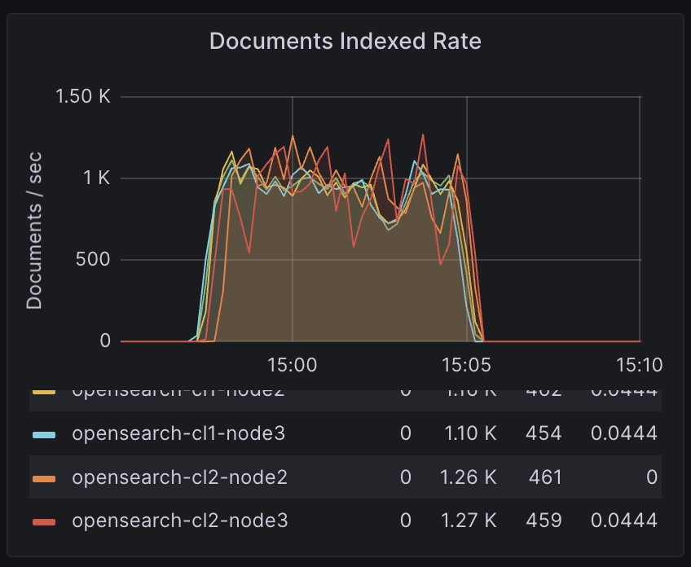
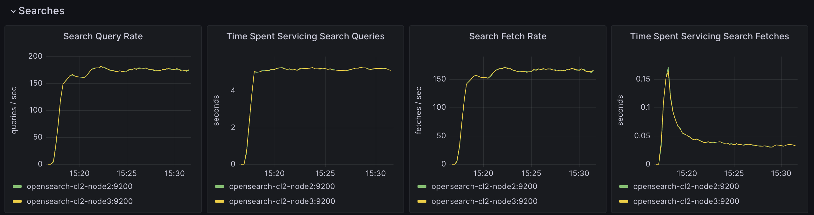
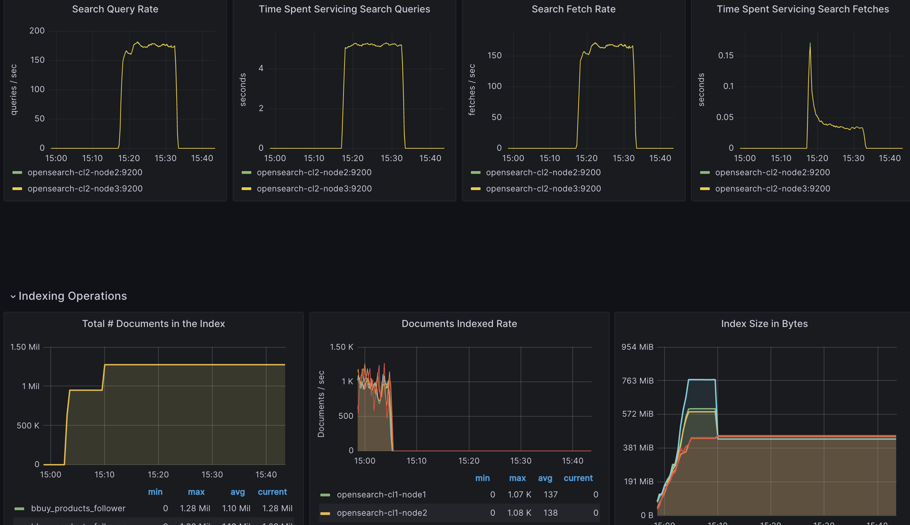

# Week Four

The replication was done following OS docs.
On the leader cluster port 9200 was exposed and on the follower one 9201, contrary to the docs, where they are switched.
After exposing the 9201 on the follower cluster I forgot to reinstall prometheus exporter plugin, that's why it's not visible on Grafana.

First screenshot is showing indexing happening for both leader and follower clusters.

The second one is showing the searching in the follower cluster.
Prior using `query.py` both port (9201 for the follower) and index name (bbuy_products_follower) needed to be adjusted.

The last screenshot is showing both indexing (replication) and search happening in the short span one after another.

